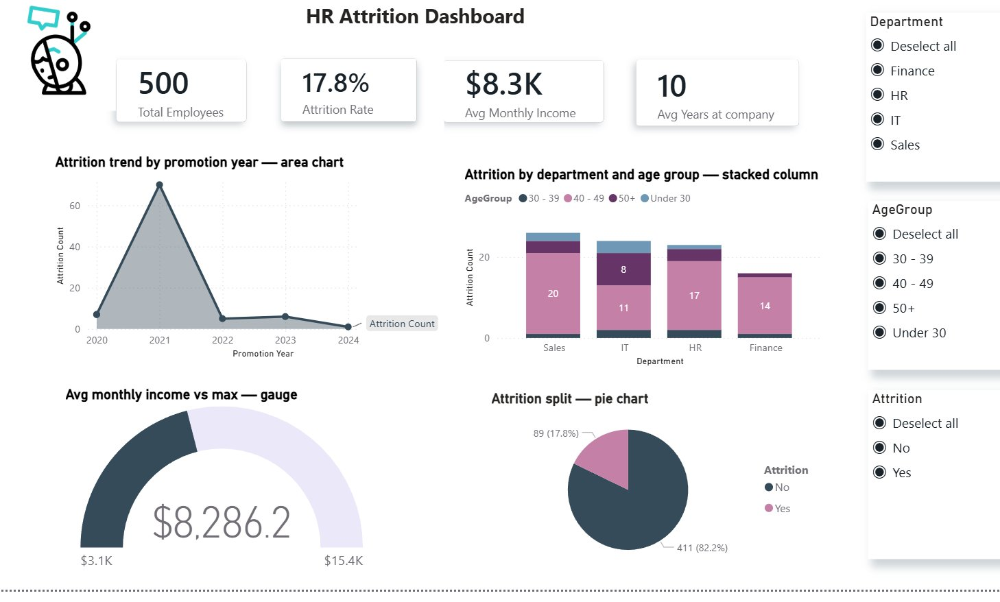
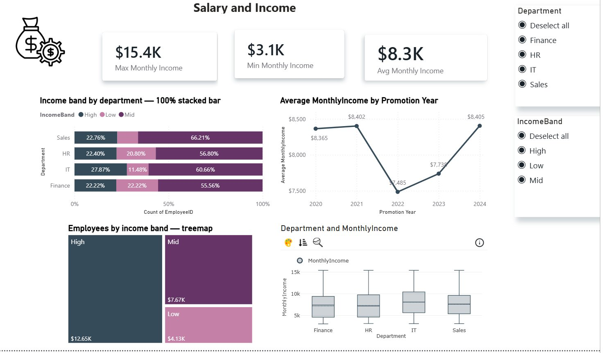
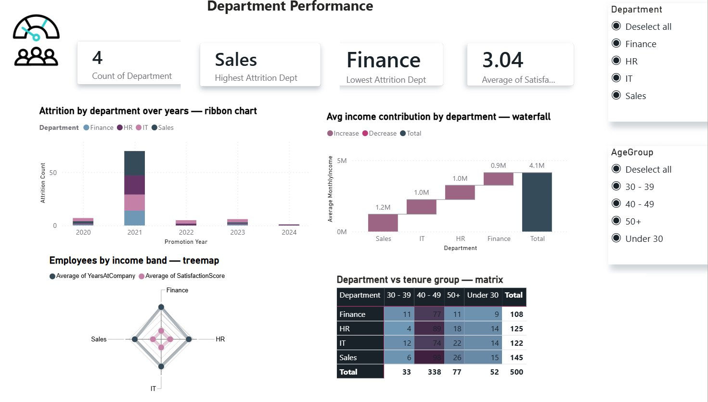
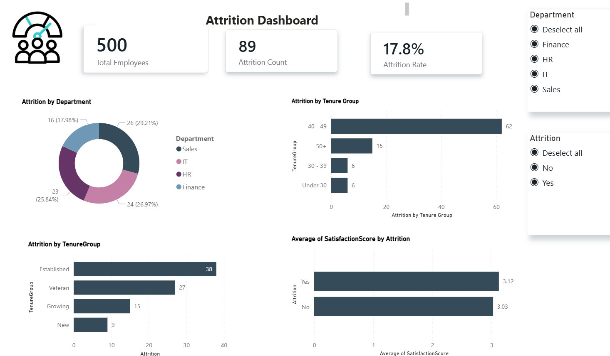

# HR Attrition Analytics

> End-to-end HR attrition analysis — synthetic data generation, Python data cleaning, and a 4-page interactive Power BI dashboard.


---

## 📌 Overview

This project demonstrates a complete data analytics workflow built entirely from scratch. Because no real HR dataset was used, the pipeline begins by **generating a synthetic dataset** with NumPy, then **deliberately injecting ~30% noise** to simulate a realistic messy file. The data is then **cleaned in Python**, **modeled in Power BI**, and visualized through a **four-page interactive dashboard** that surfaces the key drivers of employee attrition.

## 🔄 Project Pipeline

```
1. Data Generation  →  2. Noise Injection  →  3. Python Cleaning
                                                      ↓
6. Dashboard  ←  5. DAX Measures  ←  4. Power Query Transforms
```

| Stage | Tool | Outcome |
|-------|------|---------|
| **1. Data Generation** | NumPy / pandas | 500 synthetic clean employee records |
| **2. Noise Injection** | pandas | ~30% dirty cells across 8 error types |
| **3. Python Cleaning** | pandas / Jupyter | Fully cleaned dataset |
| **4. Power Query** | Power BI | Data types fixed, 4 custom columns |
| **5. DAX Measures** | Power BI | 6 calculated measures |
| **6. Dashboard** | Power BI | 4 interactive pages, 15+ charts |

---

## 📊 Dashboard Preview

### Page 1 — Attrition Overview


### Page 2 — Salary & Income


### Page 3 — Department Performance


### Page 4 — HR Overview


---

## 🗂️ Dataset

The dataset contains 500 employee records with the following schema:

| Column | Type | Description |
|--------|------|-------------|
| `EmployeeID` | Integer | Unique identifier (1001–1500) |
| `Age` | Integer | Employee age (22–64) |
| `Department` | Category | Sales, IT, HR, Finance |
| `MonthlyIncome` | Float | Monthly salary in USD |
| `YearsAtCompany` | Integer | Tenure in years |
| `Attrition` | Boolean | Whether the employee left (Yes/No) |
| `LastPromotionDate` | Date | Date of last promotion |
| `SatisfactionScore` | Integer | Job satisfaction (1–5) |

**Engineered features** (added in Power Query): `AgeGroup`, `IncomeBand`, `TenureGroup`, `PromotionYear`.

---

## 🧹 Data Cleaning Highlights

The raw data was deliberately corrupted with 8 types of errors. The cleaning notebook reverses each one:

| Issue | Fix Applied |
|-------|-------------|
| Duplicate rows | `drop_duplicates()` |
| Department typos (Saless, It , H R, Finence) | Mapping dictionary + `str.strip()` |
| Inconsistent Attrition (Y/N/NaN) | Standardized to Yes/No, nulls filled with mode |
| Missing Age & Satisfaction | Filled with median |
| Income outliers | **IQR method** (bounds floored at 0) |
| Negative tenure | `abs()` conversion |
| Invalid dates (2025-13-45) | Parsed with `errors='coerce'`, filled with median date |
| Numeric stored as text | Stripped text, converted to numeric |

```python
# IQR outlier capping — the key cleaning step
Q1 = df['MonthlyIncome'].quantile(0.25)
Q3 = df['MonthlyIncome'].quantile(0.75)
IQR = Q3 - Q1
lower = max(0, Q1 - 1.5 * IQR)   # income cannot be negative
upper = Q3 + 1.5 * IQR
df['MonthlyIncome'] = df['MonthlyIncome'].clip(lower, upper)
```

---

## 📈 DAX Measures

```dax
Total Employees = COUNT(hr_attrition_clean[EmployeeID])

Attrition Count =
CALCULATE(COUNT(hr_attrition_clean[EmployeeID]),
          hr_attrition_clean[Attrition] = "Yes")

Attrition Rate = DIVIDE([Attrition Count], [Total Employees], 0)

Avg Monthly Income = AVERAGE(hr_attrition_clean[MonthlyIncome])
```

---

## 💡 Key Insights

- **Sales has the highest attrition** at ~29% — nearly one in three employees leave.
- **A spike in attrition occurred in 2021**, far above any other year.
- The **40-49 age group** is the largest and shows the highest attrition count.
- **IT pays the highest median salary**; low-income bands concentrate in Sales.
- **Satisfaction scores are nearly identical** across departments — attrition is driven by other factors.
- **Finance is the most stable** department with the lowest attrition.

---

## 📁 Repository Structure

```
hr-attrition-analytics/
├── notebooks/
│   ├── 01_data_generation.ipynb     # Generate + inject noise
│   └── 02_data_cleaning.ipynb       # Full cleaning pipeline
├── data/
│   ├── hr_attrition_dirty.csv       # Raw noisy dataset
│   └── hr_attrition_clean.csv       # Cleaned, analysis-ready
├── dashboard/
│   └── screenshots/                 # Dashboard page exports
├── docs/
│   ├── HR_Attrition_Documentation.docx
│   └── HR_Attrition_Documentation.pptx
├── requirements.txt
├── .gitignore
├── LICENSE
└── README.md
```

---

## 🚀 Getting Started

```bash
# Clone the repository
git clone https://github.com/YOUR_USERNAME/hr-attrition-analytics.git
cd hr-attrition-analytics

# Install dependencies
pip install -r requirements.txt

# Launch the notebooks
jupyter notebook notebooks/
```

Run `01_data_generation.ipynb` first to create the dataset, then `02_data_cleaning.ipynb` to produce the clean file. Open the dashboard `.pbix` in Power BI Desktop and point it at `data/hr_attrition_clean.csv`.

---

## 🛠️ Tech Stack

- **Python** — pandas, NumPy, matplotlib
- **Jupyter Notebook** — interactive development
- **Power BI Desktop** — Power Query (M), DAX, data visualization

---

## 📄 License

This project is licensed under the MIT License — see the [LICENSE](LICENSE) file for details.

---

<p align="center">⭐ If you found this project useful, consider giving it a star!</p>
